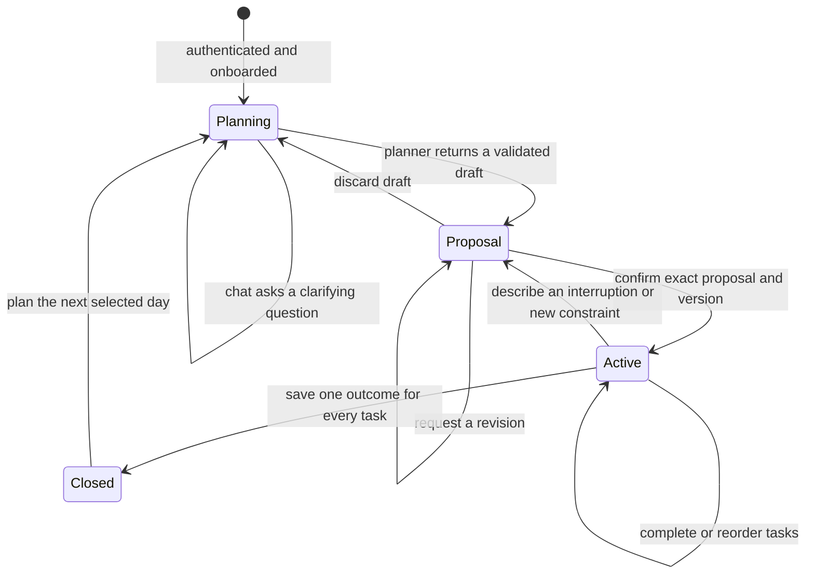

# Daily planning workflow

Caprio helps an individual professional turn the work on their mind into a realistic plan for one selected calendar day. The planner gathers tasks and constraints, proposes a complete plan, and waits for explicit confirmation before it changes saved work.

## Pages

| Route | Purpose | Primary next step |
| --- | --- | --- |
| `/` and `/landing` | Explain the product and start authentication. | Sign in or create an account. |
| `/login` and `/signup` | Authenticate with Auth0. | Continue onboarding or open the current day. |
| `/onboarding` | Choose the areas of life used to organize tasks. | Save category choices. |
| `/onboarding/prefs` | Set the usual planning time and explain the confirmation boundary. | Open the first planning conversation. |
| `/new?date=YYYY-MM-DD` | Hold the persisted planning conversation and review, revise, confirm, or discard a proposal. | Confirm a plan. |
| `/today?date=YYYY-MM-DD` | Execute the saved plan, complete tasks, reorder unfinished work, and report a changed day. | Work the plan or request an adjustment. |
| `/capture` | Store unplanned work in the inbox. | Add it directly to an open day or discuss it with the planner. |
| `/review?date=YYYY-MM-DD` | Choose an explicit outcome for every task and record optional notes and energy. | Close the current day. |
| `/momentum` | Read past conversations, plans, and reviews. | Reopen a historical day in read-only mode. |
| `/settings/*` | Manage the account, categories, planning time, and input shortcut. | Return to the daily workflow. |

## State and event flow

1. The client opens the workflow for a selected local date.
2. The API loads that day's messages, saved tasks, inbox, categories, state, version, pending proposal, and review.
3. A chat request includes a unique request ID. The API serializes mutations for the account and uses the request ID to avoid duplicate model turns.
4. The general planner receives trusted backend context plus conversation history. Task content is treated as user data.
5. The API strictly validates the planner's JSON. A proposal must account for every unfinished saved task exactly once, use only owned IDs, and fit known available time.
6. Chat saves messages and a draft. It never changes tasks.
7. Confirmation checks the proposal ID, workflow version, and task snapshot in one transaction. Only then does it create, move, and order tasks.
8. Direct task edits invalidate open drafts so the user cannot confirm an outdated plan.
9. Review requires an outcome for every task. Completed tasks stay done; unfinished tasks are completed, carried to the next day, or dropped together in one transaction.
10. Closing archives the exact task outcomes and makes the day read-only. The next-day link preserves the selected planning date.

## Agent boundary

[`src/mastra/agents/daily-planner.md`](../src/mastra/agents/daily-planner.md) is the canonical instruction contract for the single MVP planner. Build scripts embed it into the Mastra agent, and `npm run verify:planner` checks that the built instructions match the Markdown and that only the general planner is registered.

The agent can ask questions and return proposals. It cannot mutate tasks, claim that a draft was saved as a plan, accept instructions embedded in task data, or bypass confirmation. The Go API owns validation, authorization, concurrency, persistence, and all workflow transitions.
