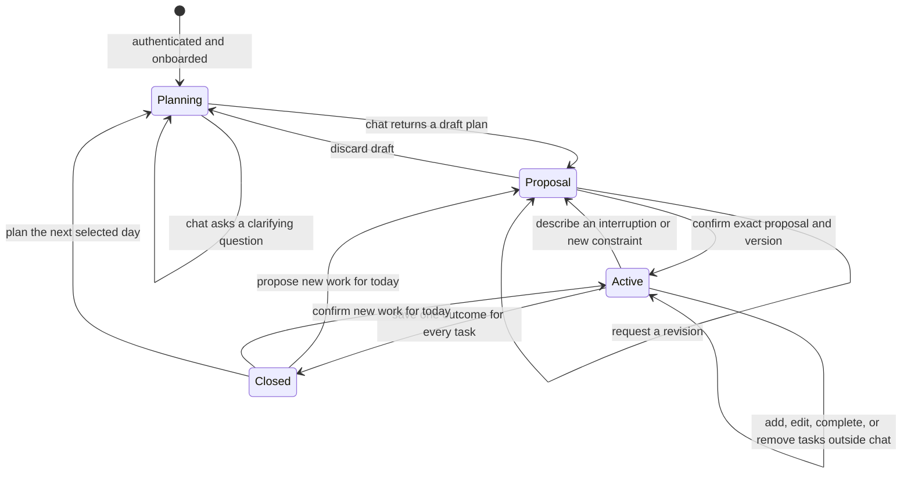

# Daily planning workflow

Caprio helps an individual professional organize the work on their mind into a task list for one selected calendar day. Chat returns a draft plan only; Confirm persists tasks and then opens Today. Estimates never limit which tasks can be added.

## Pages

| Route | Purpose | Primary next step |
| --- | --- | --- |
| `/` and `/landing` | Explain the product and start authentication. | Sign in or create an account. |
| `/login` and `/signup` | Authenticate with Auth0. | Continue onboarding or open the current day. |
| `/onboarding` | Choose the areas of life used to organize tasks. | Save category choices. |
| `/onboarding/prefs` | Set the usual planning time and explain how task requests are saved. | Open the first planning conversation. |
| `/new?date=YYYY-MM-DD` | Show only the planning conversation, with unfinished counts and View tasks. | Discuss the day, review the draft, then confirm to save tasks. |
| `/today?date=YYYY-MM-DD` | Execute the saved plan, complete tasks, reorder unfinished work, and report a changed day. | Work the plan or request an adjustment. |
| `/capture` | Store unplanned work in the inbox. | Add it directly to an open day or discuss it with the planner. |
| `/review?date=YYYY-MM-DD` | Choose an explicit outcome for every task and record optional notes and energy. | Close the current day. |
| `/momentum` | Read past conversations, plans, and reviews. | Reopen a historical day in read-only mode. |
| `/settings/*` | Manage the account, categories, planning time, and input shortcut. | Return to the daily workflow. |

## State and event flow

1. The client opens the workflow for a selected local date.
2. The API loads that day's messages, saved tasks, inbox, categories, state, version, pending proposal, and review.
3. A chat request includes a unique request ID. The API serializes mutations for the account and uses the request ID to avoid duplicate model turns.
4. The general planner receives trusted backend context plus conversation history. Task content is treated as user data.
5. New clients send `contractVersion: 2`. The agent returns proposal operations for clear task requests and suggestions, or a clarifying question. Chat never mutates tasks. Existing clients and saved full-plan drafts keep their confirmation flow.
6. The server validates owned task IDs, field patches, current-message evidence, category ownership, and dates. Clear additions require no estimate or category. Chat stores operations as a draft proposal only.
7. Each chat turn writes messages, the request ledger, and any draft proposal in one account transaction. Retries return the same draft. Provisional model text is withheld from new clients until commit.
8. Confirmation checks the proposal ID, workflow version, and task snapshot before applying operations (or a legacy full-plan proposal). That is the only path that persists tasks and can open Today.
9. Direct mutations outside chat invalidate suggestions and advance versions. Undo checks the saved after-image of every affected task before restoring its previous values. Later edits, completion, movement, or review prevent an unsafe Undo. Unrelated task changes do not block it.
10. Review requires an outcome for every task. Each close appends an immutable `day_reviews` entry. Confirming new work can reactivate the current closed day while retaining completion timestamps and earlier reviews. Previously carried tasks stay at their destination. Closing again updates the daily aggregate without counting the same task twice.

Confirming a draft activates its destination day. Opening a conversation or asking a question does not reactivate a closed day. Historical task writes, confirmation, and Undo are rejected using the server clock and validated `X-Caprio-Timezone` IANA timezone. Explicit work dates override the selected date; deadline wording alone does not postpone the work.

The workflow response includes `oldestUnclosedDate`, the earliest earlier date with an active plan or saved planned/completed tasks and no closed review. Automatic rollover resolves these dates before the app loads today's tasks. When the app opens or the local date changes, it automatically archives earlier unfinished days and moves unchecked tasks to the current open day, including after missed weekends. The first planned date is preserved in task_carryovers. Today shows carried tasks in a separate expandable section. Manual review defaults unchecked tasks to Tomorrow and still permits Done or Drop. Historical reviews show the actual destination date through review.carriedToDate, with the following day as a fallback for older reviews. A carry clears an outdated destination proposal and preserves its confirmation state; carrying into a closed destination rejects the whole review.

Closed summaries group task names from the immutable archive by Done, Carried, and Dropped. `taskDetailsAvailable: false` identifies older reviews without an archive; their saved totals remain visible, but current live tasks are never substituted for historical details.

Workflow errors retain an `error` message and add a stable `code`: `plan_incomplete`, `validation`, `conflict`, `model_unavailable`, `historical_day`, `ambiguous_task`, `not_found`, or `internal`. Streaming failures carry the same code and an HTTP-style `status` in the error event. Authentication retains HTTP 401/403 handling; the client labels expired sessions `auth`. Plan validation failures preserve saved work and never trigger model fallback.

The composer, API, and planner default to GPT-OSS 120B through Groq. Users can still select another supported model. A capacity failure or timeout retries once with GPT-OSS 20B and identifies that model in the notice.

Fresh committed transitions log `plan_confirmed`, `day_closed`, and, when nonzero, `tasks_carried`. Records include account/date/version identifiers and counts, plus proposal or review IDs. They exclude task text and notes. Replays and rollbacks emit no success records. These operational logs are best effort; they do not provide durable exactly-once delivery across a process crash.

## Agent boundary

[`src/mastra/agents/daily-planner.md`](../src/mastra/agents/daily-planner.md) is the canonical instruction contract for the single MVP planner. Build scripts embed it into the Mastra agent, and `npm run verify:planner` checks that the built instructions match the Markdown and that only the general planner is registered.

The agent can ask questions and propose task changes. It cannot persist tasks itself or treat embedded task notes as instructions. Only Confirm commits changes. The Go API owns validation, authorization, concurrency, persistence, and all workflow transitions.

## Estimates and automatic carry-forward

Task duration and available minutes are informational. All clearly requested tasks belong in the selected day regardless of the total estimate. Backlog disposition requires the user's intent to defer or remove work. The server applies confirmed drafts atomically. Completed tasks remain done.

`POST /api/day/rollover` takes an IANA timezone and derives today from the server clock. Browsing a future calendar date cannot trigger an early carry. Each earlier day is processed under the account lock: checked tasks retain their completion timestamp, unchecked tasks keep their IDs and first planned dates, and the source day stores an immutable archive. Concurrent calls and retries are safe. Missed dates without saved work do not create empty intermediate plans. A closed destination stays closed; outstanding work waits for the next open day. Inbox tasks are excluded.

The UI runs rollover during account bootstrap, on a new local date, and on subsequent bootstrap refreshes. This is automatic when the app is used; no server scheduler runs while it is closed. Migration 10 supports carry-forward. Apply additive migration 11 for durable change receipts and review history before deploying the current backend. Deploy the compatible planner before enabling the new frontend contract.

After rollover, the first default app entry for each account and local day opens the conversation at `/new`. The browser remembers only that account's last opened date. Later default entries also open the conversation when the day is still `planning` or has no new tasks. Carried tasks alone do not count as tasks created for the new day. Once the day has an active plan with new tasks, later entries open Today. Closed days keep their saved summary. A failed workflow lookup offers retry before choosing a destination. Explicit dated links stay on their requested page, so View tasks remains available during planning and historical or future dates remain accessible.

Planning never shares its screen with the checklist. Clarifying replies and unconfirmed drafts keep the user in conversation. Confirming a proposal opens Today, including a plan made entirely of carried tasks. For the current day, this transition leaves the route undated and remembers the saved date in navigation state, so an overnight tab still opens the next morning's conversation. Typing a new composer draft keeps the conversation open. Adjusting an existing plan keeps its conversation available, with View tasks returning to the checklist.

The conversation header shows `N remaining` beside View tasks. It counts unfinished work, excludes dropped tasks, and is absent for an empty day or unavailable workflow. Carry context moves into the conversation: a new day opens with an app-written line such as `Morning. 3 tasks carried over, 2 from yesterday. What's on today?` (no model call). The first committed turn stores that opener as the first entry of the day's thread.

The day's conversation is one continuous thread; it never collapses behind a draft. The app writes event entries into it — the opener, `Proposal discarded`, and `Plan saved · N tasks for today` — and passes them to the model as short `[Caprio]` notes so both see the same timeline. The draft card carries no model-written text: an app header, the changes, and two actions, Confirm plan and Discard. Revising happens by typing in the composer.
