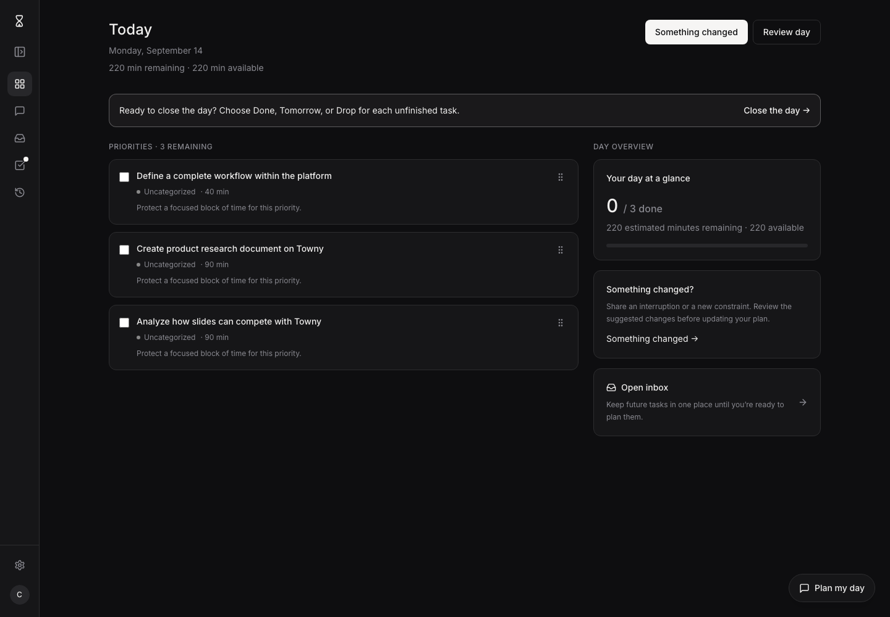
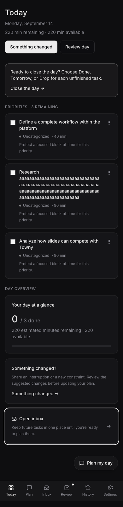

# Caprio page grid

## Problem and scope

Today has a 28 px difference between the top of its first task card and its first summary card. The task section has a heading above its cards; the summary column has none. Open inbox uses 16 px of padding and no card background, while its neighbors use 20 px and a card background. Its outside edges already align, but its contents do not.

This change defines the layout for signed-in pages and implements all Today placements. Inbox, Review, History, and Settings adopt the same page edges and header spacing. Plan keeps its conversation layout, and public and onboarding pages keep their existing layouts.

## Grid and spacing

| Element | Placement and size |
| --- | --- |
| Page shell | Center in the area beside navigation, maximum 1152 px wide |
| Outer gutters | 16 px below 768 px viewport width, 24 px above |
| Page top | 24 px on mobile, 32 px on desktop |
| Grid | Four equal tracks by default, twelve when the shell reaches 960 px |
| Grid and section gap | 24 px |
| Header to content | 32 px |
| Section heading to cards | 12 px |
| Adjacent task cards | 12 px |
| Adjacent summary cards | 16 px |
| Summary card inset | 20 px on every side, including Open inbox |
| Task card inset | 16 px |
| Card corners | 12 px |

The page shell is a CSS inline-size container. Column changes depend on its available width, so expanding the 240 px navigation can return Today to a single column. The collapsed navigation occupies 64 px. Grid tracks use `minmax(0, 1fr)`; text wraps rather than widening a track. Container queries are designed for this relationship between a component and its available space. See [MDN's container query guide](https://developer.mozilla.org/en-US/docs/Web/CSS/Guides/Containment/Container_queries).

## Today placement

| Region | Wide shell, at least 960 px | Narrow shell |
| --- | --- | --- |
| Title, date, capacity | Header columns 1–8 | Full width |
| Plan and review actions | Header columns 9–12, aligned right | Right of title when space permits; next row below 640 px |
| Close-day and proposal notices | Full width, each in its own row | Full width, action wraps beneath copy |
| Task sections | Columns 1–8 | Full width |
| Day overview | Columns 9–12 | Full width after tasks |
| Loading, error, empty, closed states | Full width | Full width |

Task sections and Day overview have matching heading styles and a 12 px gap before the first card. This aligns both the heading baseline and the top card edges. Task sections retain their order: Carried over, Priorities, Completed. Mutation errors occupy a full row above both columns. When every task is complete, the Tasks heading and completion message occupy the first task section.

The overview contains the progress card, the relevant plan adjustment card, and Open inbox. Each card fills the same column with the same border, background, radius, and inset. Open inbox remains one link; its arrow occupies a separate trailing slot. Its text explains that the inbox holds tasks for later. Card heights follow their content. Neither column stretches its cards to match the other column's height.

## Other pages

| Page | Body width on the twelve-column grid |
| --- | --- |
| Inbox and History | Eight columns, starting at the shared left edge |
| Review and Settings, including subpages | Six columns, starting at the shared left edge |

Below the twelve-column threshold, list pages fill the shell and forms cap at 560 px at the same left edge. Page headers share the Today title size and spacing. Body content may have a narrower right edge for readability; its left edge must match the page title. The shared layout components and CSS own these decisions so pages do not introduce unrelated centered widths.

## Interaction and accessibility

Keep task completion, pointer and keyboard reordering, plan adjustment, review, and inbox navigation working. Use semantic headings and a named complementary region for Day overview. Interactive tiles need a visible keyboard focus ring. The progress indicator exposes its completed count to assistive technology. Long titles, categories, and task explanations wrap inside their allotted track.

The reading and tab order remains header, notices, tasks, overview. The mobile layout uses this same order without CSS reordering. Keep the existing bottom clearance for mobile navigation and the floating Plan my day action. At the end of a page, the last control must scroll above both. Check reflow at 320 CSS px, the narrow-width target described in [W3C's Reflow guidance](https://www.w3.org/WAI/WCAG21/Understanding/reflow.html).

## Acceptance checks

- At desktop widths with expanded and collapsed navigation, the first task and overview cards start at the same vertical coordinate. Overview cards have matching left and right edges, 20 px insets, and 16 px gaps.
- At a 1200 px viewport, expanding navigation stacks the overview; collapsing it restores the split. This tests available content width rather than a window-only breakpoint.
- At 320, 390, and 768 px, all Today content fits without horizontal scrolling, including long unbroken task text and both header actions.
- Across Inbox, Review, History, and Settings, the title and body share the same left edge as Today at a fixed viewport and navigation state.
- Exercise active, carried, completed, planning, proposed, empty, error, loading, historical, and closed states. Completion and keyboard reordering still save through the existing API calls.
- Check the bottom controls, keyboard focus, and screenshots in a real browser. Existing workflow tests remain green.

## Running the browser checks

From `frontend`, run `npx playwright install chromium` once, then `npm run test:e2e`. The suite starts Vite on port 4174, uses the existing development demo session, freezes the date, and intercepts API responses with sample tasks. It needs no Auth0 account or backend. GitHub Actions runs it as Frontend: Layout and saves screenshots and failure traces in its artifacts.

## Implemented layout

These browser captures use sample tasks. The mobile capture includes a long unbroken title to check wrapping.

